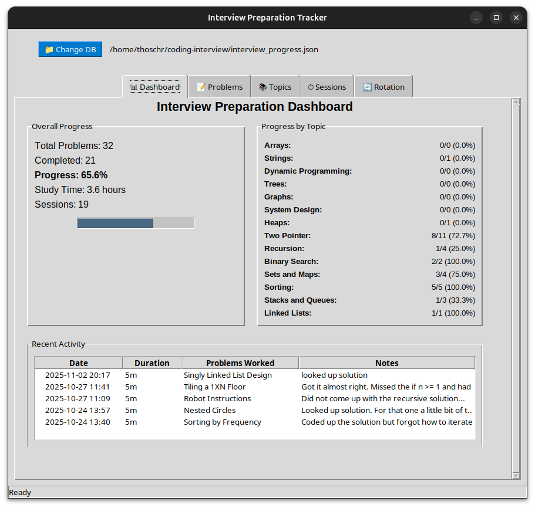

<p align="center">
  <picture>
    
  </picture>
</p>

# Codiac

A Python GUI application to track your progress in coding-interview preparation.

## Features

- Track coding problems by topic (algorithms, data structures, etc.)
- Record difficulty levels and completion status
- Time tracking for study sessions
- Progress statistics and analytics
- Multiple database support - Switch between different databases for different projects/goals

## Quick Start

```bash
python src/codiac.py
```

## GUI Features

The application provides an intuitive interface with multiple tabs:

- **📊 Dashboard**: Overview of your progress with statistics and recent activity
- **📝 Problems**: Manage coding problems with filtering, adding, editing, and progress tracking
- **📚 Topics**: Organize problems by study topics (Arrays, DP, Trees, etc.)
- **⏱️ Sessions**: Log and view study sessions with time tracking
- **🔄 Rotation**: Review completed problems on a rotation schedule

## Installation

1. Clone this repository
2. Install dependencies: `pip install -r requirements.txt`
3. Run: `python src/codiac.py`

## Data Storage

- Data is automatically saved to JSON files
- Default location: `~/.codiac/interview_progress.json` 
- Database location is configurable via the GUI
- Last location is remembered and stored in: `~/.codiac/codiac_location.json`

## Impressions
<p align="center">
  <picture>
    
  </picture>
</p>

